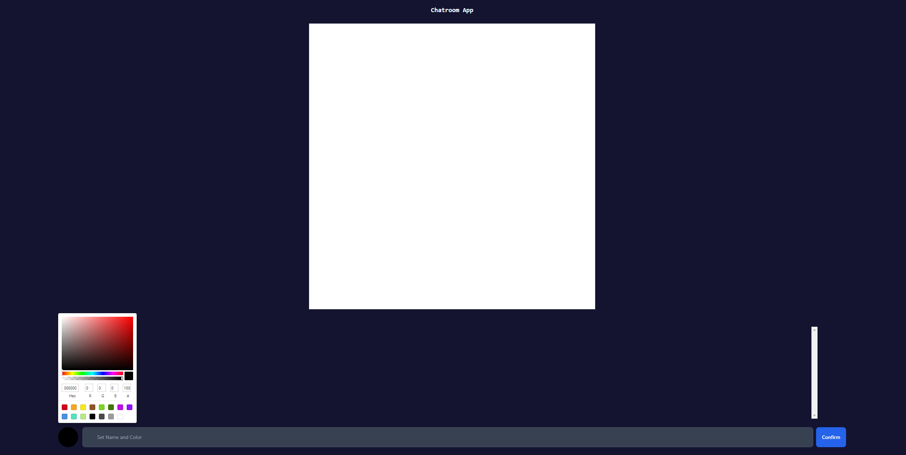

# [App Link](https://chatroom-frontend-one.vercel.app/)

This is a react web application for a global chatroom that includes a 100x100 pixel drawing canvas. Each client can connect, choose a name and color, and chat/draw with anyone also at the same web address. Chat messages are not logged and are only visible to those connected at the time of sending. The drawing canvas, on the other hand, is synchronized across everyone connected and is cleared once every 24 hours.

This client application was written in react using typescript and styled with TailwindCSS. Additionally, [react-color](https://casesandberg.github.io/react-color/) and [socket.io](socket.io) were used for the color picker and websocket communications, respectively. Finally, the app is hosted using Vercel.

### Backend repository found [here](https://github.com/ec-2018/chatroom-backend)
